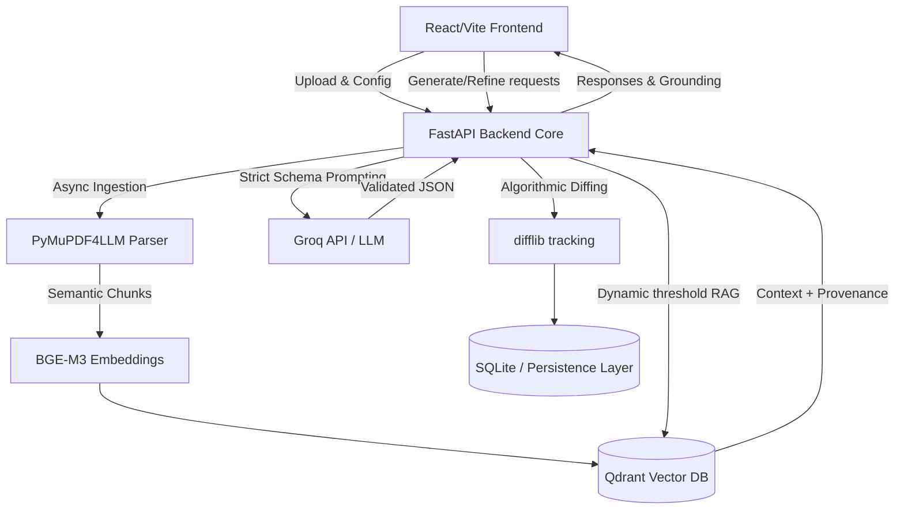

# Architecture & Systems Design

At its heart, SARAL is a multi-tenant-ready web system designed to handle asynchronous workflows, complex data modeling, and high-trust user interactions.

## Key Engineering Pillars

*   **Robust Service Boundaries**: The backend is decoupled into distinct services (`IngestionService`, `RAGService`, `GenerationService`, `ChangeTrackingService`). This makes it trivial to swap out underlying technologies (like swapping Docling for PyMuPDF4LLM, or moving from SQLite to PostgreSQL) as the platform scales.
*   **Trust & Provenance (Grounding)**: In the public sector, hallucinations are unacceptable. The `GenerationService` strictly enforces citation grounding. The frontend maps these `source_ids` to clickable badges, allowing users to verify every single generated claim directly against the original paper's chunks.
*   **Algorithmic Change Tracking**: Instead of relying on LLMs to self-report diffs (which is highly prone to hallucination), our `ChangeTrackingService` strictly manages slide revisions by computing exact word-level diffs on the server-side using standard algorithmic tools. The LLM only handles the text transformation.
*   **Scalable API Design**: Built with Python & **FastAPI**, featuring async workflows for document ingestion and generation, preparing the ground for queue-based processing (e.g., Celery) in production.
*   **Modern Frontend Experience**: A responsive, fast UI built in **React** and **Vite**, tailored for multiple personas (researchers, reviewers, public) to effortlessly explore output and seamlessly manage iterative refinements.
